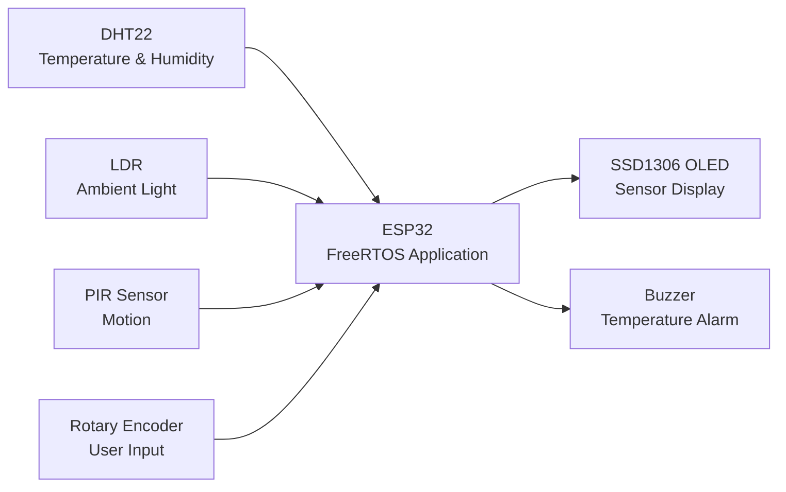
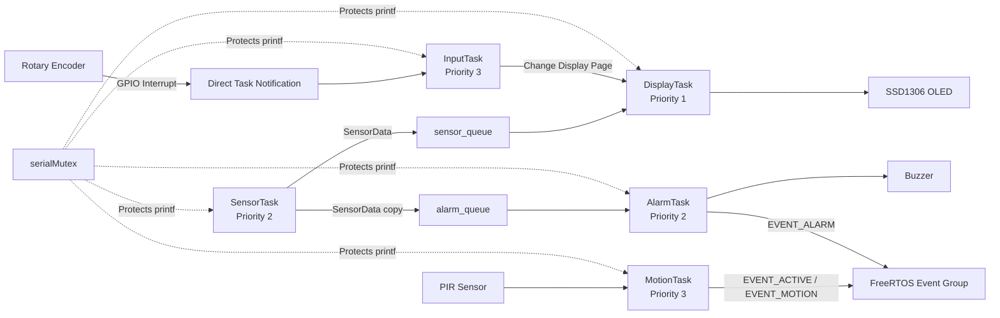
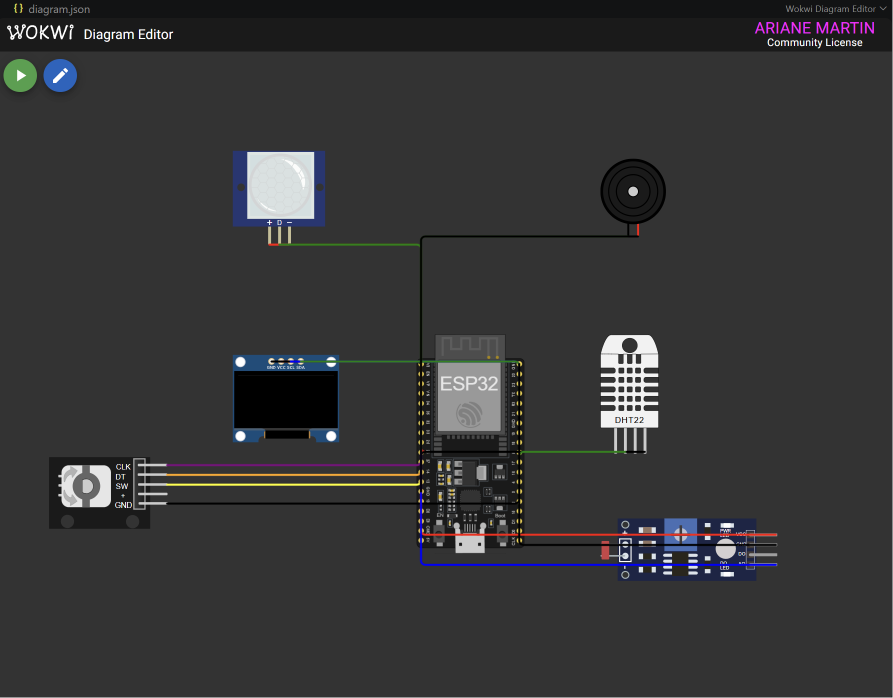
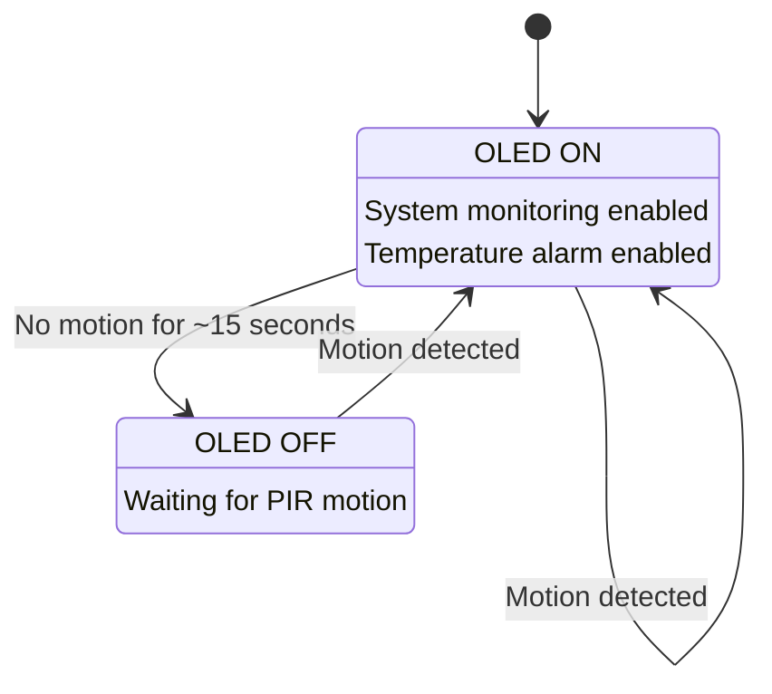
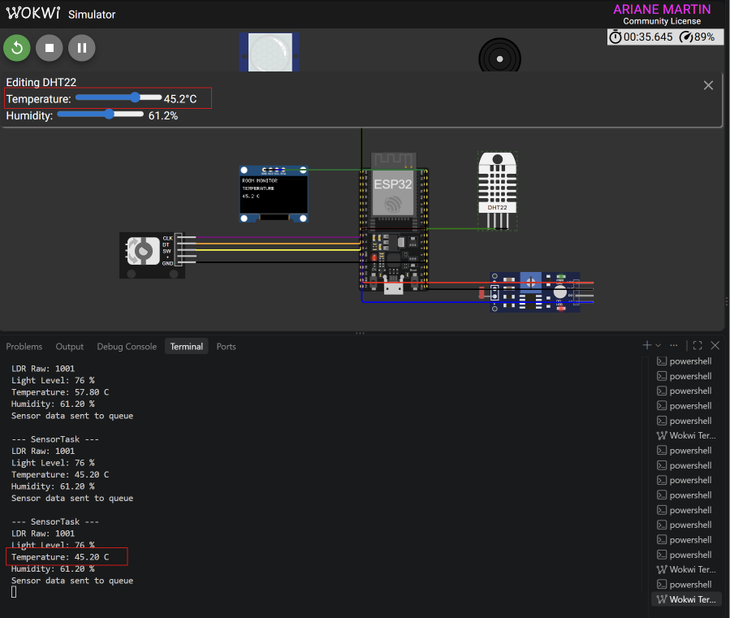

# FreeRTOS-Based ESP32 Real-Time Multisensor Room Monitoring System

## Project Overview

The **FreeRTOS-Based ESP32 Real-Time Multisensor Room Monitoring System** is a simulated embedded system developed using an ESP32, ESP-IDF, FreeRTOS, PlatformIO, and Wokwi. The system monitors room conditions such as temperature, humidity, ambient light, and motion while providing user interaction through an OLED display and rotary encoder.

Instead of placing all system functions inside a single program loop, the project uses multiple FreeRTOS tasks with separate responsibilities. Sensor acquisition, display management, user input, motion detection, and temperature alarm handling operate as individual tasks and communicate using FreeRTOS queues, an event group, a task notification, and a mutex.

This project was developed for **BCA152 Microcontrollers – Laboratory Activity No. 1** at Mindanao State University – Iligan Institute of Technology. Its main purpose is to demonstrate the design, implementation, testing, and documentation of a concurrent embedded system using FreeRTOS.

## Features

- Real-time temperature and humidity monitoring using the DHT22 sensor.
- Ambient light monitoring using an LDR with a relative 0–100% light level.
- PIR-based motion detection.
- SSD1306 OLED display for showing sensor information.
- Rotary encoder navigation between Temperature, Humidity, Light, and Motion pages.
- Temperature alarm using a buzzer when the temperature is below 18°C or above 30°C.
- Automatic ACTIVE and INACTIVE system states based on motion activity.
- Automatic transition to INACTIVE after approximately 15 seconds without motion.
- Automatic wake-up when motion is detected.
- Five concurrent FreeRTOS tasks with different responsibilities and priorities.
- Queue, mutex, event group, and direct task notification for inter-task communication and synchronization.
- Native unit testing using PlatformIO and Unity.

## Learning Objectives

This project applies the main concepts of embedded systems and real-time operating systems through a complete ESP32 application. The learning objectives are:

- Apply FreeRTOS concepts in an ESP32 embedded system.
- Create and manage multiple concurrent tasks.
- Understand task priorities and the Running, Ready, and Blocked states.
- Use queues for safe data transfer between tasks.
- Use a mutex to protect a shared resource.
- Use an event group and direct task notification for event-based communication.
- Implement accurate periodic execution using `vTaskDelayUntil()`.
- Interface sensors, input devices, a display, and an actuator with the ESP32.
- Design ACTIVE and INACTIVE system states.
- Separate hardware-independent logic from hardware-dependent code.
- Perform automated unit testing and static code analysis.
- Maintain meaningful Git version-control history throughout development.

## System Architecture

The system uses a modular architecture in which each major responsibility is separated into its own component. The ESP32 receives environmental information from the DHT22, LDR, and PIR sensor and receives user input from the rotary encoder.

The firmware then divides the work among five FreeRTOS tasks. `SensorTask` handles environmental measurements, `InputTask` processes rotary encoder events, `MotionTask` handles motion and activity behavior, `AlarmTask` evaluates temperature conditions, and `DisplayTask` controls the OLED.

`app_main()` is mainly responsible for creating the FreeRTOS communication objects, initializing the system, and creating the application tasks. This keeps the main application organized instead of placing all system behavior inside one continuous loop.

> **Figure 1. System Architecture Diagram.** Shows how the simulated input devices and sensors connect to the ESP32 application and how the system produces OLED and buzzer outputs.



## FreeRTOS Architecture

The application is divided into five meaningful FreeRTOS tasks. Each task has a specific responsibility, priority, and blocking behavior so that the system can perform several activities concurrently without relying on one continuous application loop.

| Task | Responsibility | Trigger / Period | Priority | Communication | Typical Blocked State |
|---|---|---|---:|---|---|
| `SensorTask` | Reads temperature, humidity, and light data | Every 2 seconds | 2 | Queues | `vTaskDelayUntil()` |
| `DisplayTask` | Updates and owns the OLED display | Sensor update | 1 | `sensor_queue` | Waiting for queue data |
| `InputTask` | Processes rotary encoder input | Encoder event | 3 | Task notification | Waiting for notification |
| `MotionTask` | Detects motion and manages activity | Short periodic check | 3 | Event group | `vTaskDelay()` |
| `AlarmTask` | Evaluates temperature and controls the buzzer | Sensor update | 2 | `alarm_queue` | Waiting for queue data |

The priorities were selected according to scheduling urgency rather than general importance. `InputTask` and `MotionTask` use priority 3 because they respond to external events where quick response is desirable. `SensorTask` and `AlarmTask` use priority 2 because small scheduling delays are acceptable. `DisplayTask` uses priority 1 because updating the OLED is less time-critical.

`SensorTask` uses `vTaskDelayUntil()` to maintain an approximately fixed two-second sampling period. Tasks that wait for queues or notifications enter the Blocked state instead of continuously consuming CPU time.

> **Figure 2. FreeRTOS Task-Communication Diagram.** Shows the five application tasks and the queues, event group, task notification, and mutex used for communication and synchronization.



## Hardware / Simulated Components

The complete system is simulated in Wokwi using the following components:

| Component | Purpose |
|---|---|
| ESP32 DevKit C V4 | Main microcontroller and FreeRTOS platform |
| DHT22 | Measures temperature and humidity |
| Photoresistor / LDR | Measures relative ambient light level |
| PIR Motion Sensor | Detects motion in the monitored area |
| Rotary Encoder | Allows the user to navigate between display pages |
| SSD1306 OLED | Displays sensor measurements and system information |
| Buzzer | Provides an alarm for abnormal temperature conditions |

> **Figure 3. Wokwi Circuit.** Complete simulated hardware configuration showing the ESP32 connected to the environmental sensors, rotary encoder, OLED display, and buzzer.



## Pin Configuration

The following ESP32 pins are used by the simulated hardware:

| Component | Signal | ESP32 Pin |
|---|---|---|
| DHT22 | Data | GPIO 15 |
| LDR | Analog Output | GPIO 34 / ADC1 Channel 6 |
| PIR Motion Sensor | Output | GPIO 27 |
| Rotary Encoder | CLK | GPIO 32 |
| Rotary Encoder | DT | GPIO 33 |
| Rotary Encoder | SW | GPIO 25 |
| SSD1306 OLED | SDA | GPIO 21 |
| SSD1306 OLED | SCL | GPIO 22 |
| Buzzer | Signal | GPIO 26 |

The LDR uses the ESP32 ADC to produce a relative light level from 0–100%. The OLED communicates through I²C and is controlled only by `DisplayTask`.

## Task Design

### SensorTask

`SensorTask` is responsible for reading the DHT22 and LDR every two seconds. It collects temperature, humidity, light level, and the current motion status into a `SensorData` structure. The sensor information is then sent to the tasks that need it through FreeRTOS queues.

The task uses `vTaskDelayUntil()` instead of a simple busy loop so that sensor acquisition follows a regular sampling schedule without continuously consuming CPU time.

### DisplayTask

`DisplayTask` is the sole owner of the SSD1306 OLED. It waits for sensor information from `sensor_queue` and displays one of four pages: **Temperature, Humidity, Light, or Motion**.

Keeping OLED access inside one task avoids multiple tasks attempting to write to the same display at the same time.

### InputTask

`InputTask` handles the rotary encoder. A GPIO interrupt detects encoder activity and sends a direct task notification to `InputTask`. The task remains Blocked while no encoder event is present instead of continuously polling for input.

Clockwise rotation moves to the next display page, while counterclockwise rotation moves to the previous page. Navigation wraps between the first and last pages.

### MotionTask

`MotionTask` monitors the PIR sensor and manages the activity behavior of the system. Motion status is represented through the FreeRTOS event group.

If no motion is detected continuously for approximately 15 seconds, the system changes from ACTIVE to INACTIVE. Motion detected while the system is INACTIVE immediately returns it to ACTIVE.

### AlarmTask

`AlarmTask` receives sensor updates through `alarm_queue` and evaluates the current temperature.

The alarm conditions are:

- Temperature below **18°C** → Low-temperature alarm.
- Temperature from **18°C to 30°C** → Normal.
- Temperature above **30°C** → High-temperature alarm.

When an abnormal temperature is detected while the system is ACTIVE, the buzzer is activated and `EVENT_ALARM` is set. When the temperature returns to the normal range, the buzzer is turned off and the alarm event is cleared.

## Inter-Task Communication

The system uses different FreeRTOS communication and synchronization mechanisms depending on the type of information being exchanged.

### Queues

Two FreeRTOS queues are used to distribute sensor information:

- `sensor_queue` transfers `SensorData` from `SensorTask` to `DisplayTask`.
- `alarm_queue` transfers a separate copy of `SensorData` from `SensorTask` to `AlarmTask`.

Separate queues are used because receiving an item from a FreeRTOS queue removes that item. If both consumer tasks used the same queue, `DisplayTask` and `AlarmTask` could compete for sensor updates instead of both receiving the required data.

### Event Group

The shared event group `system_events` represents important system conditions using three event bits:

- `EVENT_ACTIVE` – indicates that the system is currently ACTIVE.
- `EVENT_MOTION` – indicates that motion is currently detected.
- `EVENT_ALARM` – indicates that a temperature alarm condition is active.

The event group allows tasks to communicate system conditions without repeatedly passing separate variables between them.

### Direct Task Notification

The rotary encoder uses an interrupt to notify `InputTask`. When an encoder event occurs, the ISR sends a direct task notification. `InputTask` can therefore remain Blocked while there is no user input and wake only when an event requires processing.

### Mutex

`serialMutex` protects the Serial console used by multiple tasks for diagnostic `printf()` messages. A task takes the mutex before entering a protected Serial-output section and releases it afterward. This prevents multiple tasks from accessing the shared output resource at the same time and reduces the possibility of interleaved diagnostic messages.

## State Machine

The system uses two main operating states: **ACTIVE** and **INACTIVE**.

### ACTIVE State

The system starts in the ACTIVE state. Sensor monitoring continues normally, the OLED can display sensor information, the rotary encoder can be used for navigation, and the temperature alarm can operate.

If no motion is detected continuously for approximately 15 seconds, the system transitions to INACTIVE.

### INACTIVE State

When the system becomes INACTIVE, the OLED is powered off and the temperature alarm output is disabled. Motion monitoring continues so that the system can detect when a person returns.

When the PIR sensor detects motion while the system is INACTIVE, the system immediately transitions back to ACTIVE.

The ACTIVE/INACTIVE condition is represented by `EVENT_ACTIVE` in the FreeRTOS event group.

> **Figure 4. System State-Machine Diagram.** The system changes from ACTIVE to INACTIVE after approximately 15 seconds without motion and returns to ACTIVE when PIR motion is detected.



## Repository Structure

The repository separates application modules, headers, hardware drivers, test logic, and project configuration files.

```text
bca152-freertos-multisensor/
├── include/
│   ├── alarm.h
│   ├── dht22.h
│   ├── display.h
│   ├── display_mode.h
│   ├── input.h
│   ├── motion.h
│   ├── oled.h
│   ├── rtos_objects.h
│   ├── sensors.h
│   └── system_state.h
│
├── src/
│   ├── alarm.c
│   ├── alarm.cpp
│   ├── dht22.c
│   ├── display.cpp
│   ├── display_mode.cpp
│   ├── input.cpp
│   ├── main.c
│   ├── motion.cpp
│   ├── oled.c
│   ├── rtos_objects.cpp
│   ├── sensors.cpp
│   ├── system_state.cpp
│   └── system_state_logic.cpp
│
├── docs/
│   ├── images/
│   │   ├── finished-system.png
│   │   └── wokwi-circuit.png
│   └── videos/
│       └── final-testing.mp4
│
├── test/
│   └── test/
│       └── test_logic/
│           └── test_main.cpp
│
├── diagram.json
├── platformio.ini
├── wokwi.toml
└── README.md
```

The modular structure keeps hardware-independent decision logic separate from hardware-specific code where practical. For example, temperature alarm decisions and system-state decisions can be tested without requiring the simulated ESP32 hardware.

## Getting Started

### Requirements

To build and simulate this project, the following software is required:

- Visual Studio Code
- PlatformIO
- ESP-IDF toolchain
- Wokwi for Visual Studio Code
- Git

The project uses **ESP-IDF and native FreeRTOS APIs**. The Arduino framework and Arduino-specific APIs are not used.

### Clone the Repository

Clone the project and enter the repository directory:

```bash
git clone https://github.com/ariane-martin/bca152-freertos-multisensor.git
cd bca152-freertos-multisensor
```

Open the project folder in Visual Studio Code. PlatformIO will use the configuration in `platformio.ini` to prepare the project environment.

## Building the Project

Build the ESP32 firmware using the PlatformIO terminal:

```bash
pio run -e esp32dev
```

The `esp32dev` environment uses the ESP32 development board with the ESP-IDF framework. A successful build confirms that the firmware compiles correctly before running the simulation.

## Running the Wokwi Simulation

After successfully building the ESP32 firmware, create the merged firmware binary required by the Wokwi configuration:

```powershell
& "$env:USERPROFILE\.platformio\penv\Scripts\platformio.exe" pkg exec -p tool-esptoolpy -- esptool.py --chip esp32 merge_bin -o .pio/build/esp32dev/wokwi-firmware.bin --flash_mode dio --flash_freq 40m --flash_size 2MB 0x1000 .pio/build/esp32dev/bootloader.bin 0x8000 .pio/build/esp32dev/partitions.bin 0x10000 .pio/build/esp32dev/firmware.bin
```

After generating the merged firmware, open the Wokwi simulator in Visual Studio Code and start the simulation.

The simulation allows the user to change the DHT22 temperature and humidity, adjust the simulated light level, trigger PIR motion, and rotate the encoder to verify the behavior of the complete system.

> **Figure 5. Finished-System Screenshot.** Final Wokwi simulation showing the complete multisensor room-monitoring system operating with the ESP32, sensors, OLED, rotary encoder, and buzzer.



## Unit Testing

Hardware-independent application logic was tested using PlatformIO's native testing environment and the Unity test framework.

The test suite contains **14 meaningful test cases** covering three main areas:

- Temperature alarm decisions, including the 18°C and 30°C boundaries.
- Display-page navigation, including clockwise, counterclockwise, and wraparound behavior.
- ACTIVE and INACTIVE system-state transitions based on motion and inactivity.

Run the automated tests using:

```bash
pio test
```

The final test execution produced:

```text
14 test cases: 14 succeeded
```

Separating decision logic from hardware-dependent code allows important system behavior to be tested without requiring the ESP32 or Wokwi simulation.

## Static Code Analysis

Static code analysis was performed using PlatformIO Check:

```bash
pio check -e esp32dev
```

The final analysis produced the following severity counts:

| Severity | Findings |
|---|---:|
| High | 0 |
| Medium | 0 |
| Low | 7 |

The seven remaining findings were low-severity `unusedFunction` style warnings. An earlier analysis reported eight low-severity findings, including an actionable style issue in `oled.c`, where an array that was never modified had not been declared as `const`. This issue was corrected by declaring the array as `const`.

The final analysis reported **0 high-severity, 0 medium-severity, and 7 low-severity findings**. PlatformIO marked the cppcheck execution as `FAILED` because low-severity findings remained in the analysis output. However, no high- or medium-severity defects were reported.

The remaining `unusedFunction` findings were reviewed in the context of ESP-IDF framework entry points, C/C++ module interaction, and native unit testing rather than being removed without analysis.

## Functional Verification

The complete system was manually verified in Wokwi in addition to automated unit testing.

| Test ID | Input / Stimulus | Expected Result | Actual Result | Result |
|---|---|---|---|---|
| FT-01 | Change DHT22 temperature | Displayed temperature updates | Temperature value updated in the system | PASS |
| FT-02 | Change DHT22 humidity | Displayed humidity updates | Humidity value updated in the system | PASS |
| FT-03 | Change simulated light level | Relative light value changes | Light percentage changed with illumination | PASS |
| FT-04 | Rotate encoder clockwise | Move to next display page | OLED advanced to the next page | PASS |
| FT-05 | Rotate encoder counterclockwise | Move to previous display page | OLED returned to the previous page | PASS |
| FT-06 | Set temperature above 30°C | Temperature alarm activates | High-temperature alarm and buzzer activated | PASS |
| FT-07 | Return temperature to normal range | Alarm stops | Alarm returned to NORMAL and buzzer stopped | PASS |
| FT-08 | Generate PIR motion | System is ACTIVE | Motion maintained or returned the system to ACTIVE | PASS |
| FT-09 | Leave system without motion for approximately 15 seconds | System becomes INACTIVE | System entered INACTIVE and OLED turned off | PASS |
| FT-10 | Generate motion while INACTIVE | System returns to ACTIVE | System returned to ACTIVE and OLED turned on | PASS |

### Functional Demonstration Video

The following screen recording demonstrates the functional verification of the system, including sensor updates, OLED page navigation, temperature alarm behavior, ACTIVE/INACTIVE transitions, and PIR-based wake-up.

[▶ Watch the Functional Testing Video](docs/videos/final-testing.mp4)

Functional testing also revealed an error in the original LDR percentage mapping. The calculation was corrected so that greater simulated illumination produces a greater relative light percentage. This demonstrates how functional verification was used to identify and correct an implementation issue.

## Engineering Decisions

Several design decisions were made to improve concurrency, synchronization, and maintainability.

**Separate application tasks.** Sensor acquisition, display management, user input, motion detection, and alarm handling were assigned to separate FreeRTOS tasks instead of placing most application behavior inside one task.

**Two sensor queues.** `sensor_queue` delivers sensor information to `DisplayTask`, while `alarm_queue` delivers a separate copy to `AlarmTask`. Separate queues prevent the two consumers from competing to remove messages from one queue.

**Periodic SensorTask.** `vTaskDelayUntil()` is used by `SensorTask` to maintain a regular two-second sampling schedule and reduce timing drift.

**Single OLED owner.** Only `DisplayTask` directly controls the OLED, avoiding conflicting display access from multiple tasks.

**Interrupt-driven encoder input.** The rotary encoder uses a GPIO interrupt and direct task notification so that `InputTask` can remain Blocked when no input requires processing.

**Event-based system state.** The FreeRTOS event group represents ACTIVE, motion, and alarm conditions. `EVENT_ACTIVE` is used when tasks need to determine whether the system is ACTIVE or INACTIVE.

**Protected Serial output.** `serialMutex` protects diagnostic Serial output because several tasks may call `printf()` while the system is running.

**Priority based on urgency.** `InputTask` and `MotionTask` use priority 3 for responsive external-event handling. `SensorTask` and `AlarmTask` use priority 2, while `DisplayTask` uses priority 1 because display refreshes are less time-critical.

## Limitations

The project was developed primarily for Wokwi simulation and laboratory evaluation, so several limitations remain.

- The LDR output represents a **relative 0–100% light level** and should not be interpreted as calibrated lux.
- The approximately 15-second inactivity timeout is intentionally short to make laboratory testing practical.
- Sensor behavior is simulated and may differ from physical hardware because of noise, timing, wiring, and electrical characteristics.
- Sensor-failure handling is limited.
- Diagnostic Serial output is intended mainly for development and verification.
- The current system does not provide persistent storage, remote monitoring, or network communication.

## Future Improvements

Possible future improvements include:

- Testing and deploying the system on physical ESP32 hardware.
- Adding calibrated ambient-light measurement.
- Allowing temperature alarm thresholds to be configured by the user.
- Making the inactivity timeout configurable.
- Improving sensor-disconnection and invalid-reading handling.
- Adding persistent storage for configuration and historical measurements.
- Adding Wi-Fi or another communication method for remote monitoring.
- Expanding the system with additional environmental sensors.

## References and Acknowledgments

This project was developed for **BCA152 Microcontrollers – Laboratory Activity No. 1: Real-Time Multisensor Room Monitoring System** under the Department of Computer Applications, College of Computer Studies, Mindanao State University – Iligan Institute of Technology.

The laboratory activity and technical requirements were prepared by **Asst. Prof. Paul Rodolf P. Castor, M.Sc.**

Technologies and tools used in the development of the project include:

- Espressif ESP-IDF
- FreeRTOS
- PlatformIO
- Wokwi
- Unity Test Framework
- Git and GitHub